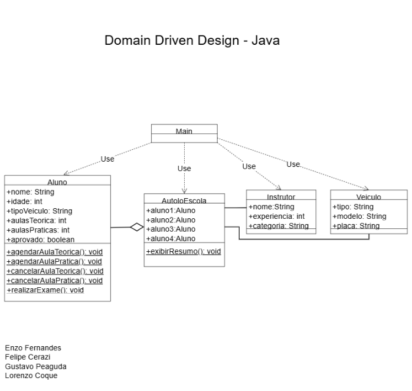

# 🚦 Checkpoint 1 - Sistema de Gestão de Autoescola
**Disciplina:** Domain Driven Design (DDD)  
**Professora:** Damiana Costa

## 👥 Integrantes do Grupo
* **Enzo Fernandes** - RM563705
* **Felipe Cerazi** - RM562746
* **Gustavo Peaguda** - RM562923
* **Lorenzo Coque** - RM563385

---

## 📊 Parte 2 - Diagrama de Classes UML

O diagrama abaixo representa a arquitetura completa do sistema, mapeando a estrutura de objetos e seus relacionamentos:

### 🔍 Descrição Técnica do Diagrama
Para garantir a clareza do projeto, o diagrama utiliza as seguintes notações da UML:

* **Dependência (Linhas Tracejadas):** A classe `Main` atua como a orquestradora do sistema. Ela possui setas de dependência para `AutoEscola`, `Aluno`, `Instrutor` e `Veiculo`, indicando que ela instancia e utiliza essas classes para executar o programa.
* **Agregação (Linha com Losango Vazio):** Existe uma relação de agregação entre `AutoEscola` e `Aluno`. Isso indica que a Autoescola é composta por alunos, mas que o ciclo de vida do aluno é independente da instituição.
* **Associação (Linhas Sólidas):** Conectam a `AutoEscola` ao `Instrutor` e ao `Veiculo`, demonstrando que essas entidades estão vinculadas estruturalmente para permitir a realização das aulas e a exibição de resumos.

---

## 📝 Parte 3 - Questões Discursivas

### 1. Classes vs. Objetos
A **Classe** funciona como um "molde", definindo os atributos (dados) e métodos (comportamentos) que todos os objetos daquele tipo possuirão. No sistema, a classe `Aluno` define a estrutura comum. O **Objeto** é a materialização dessa classe na memória (**instância**). Por exemplo, `aluno1` (Enzo) é um objeto real com estado próprio, criado a partir do molde `Aluno`.

### 2. Funcionamento do Objeto
* **A) Execução:** Ao executar o comando `aluno1.agendarAulaPratica()`, o Java utiliza a referência do objeto para localizar seu endereço de memória e invoca o comportamento definido no método.
* **B) Atributo Modificado:** O atributo modificado é o **`aulasPraticas`**. Isso ocorre porque o método acessa o **estado interno** da instância específica e incrementa seu valor através da lógica de negócio definida na classe.

### 3. Lógica do Sistema
O método `realizarExame()` opera como um validador de requisitos mínimos. Ele utiliza uma **estrutura condicional (`if-else`)** combinada com o **operador lógico AND (`&&`)** para verificar se os atributos `aulasTeoricas` e `aulasPraticas` atingiram o valor mínimo exigido (5 aulas). A aprovação (`aprovado = true`) só é processada se ambos os critérios forem atendidos simultaneamente.

### 4. Evolução do Diagrama (Bicicleta Elétrica)
Para adicionar uma "Bicicleta Elétrica", aplicaríamos o conceito de **Herança**. Criaríamos uma nova classe `BicicletaEletrica` que estende (`extends`) a classe pai `Veiculo`. No diagrama, isso seria representado por uma linha com uma seta de ponta triangular vazia (especialização). A nova classe herdaria automaticamente os atributos `modelo` e `placa`, permitindo adicionar apenas campos específicos, como `autonomiaBateria`, evitando a repetição desnecessária de código e mantendo a organização do sistema.
